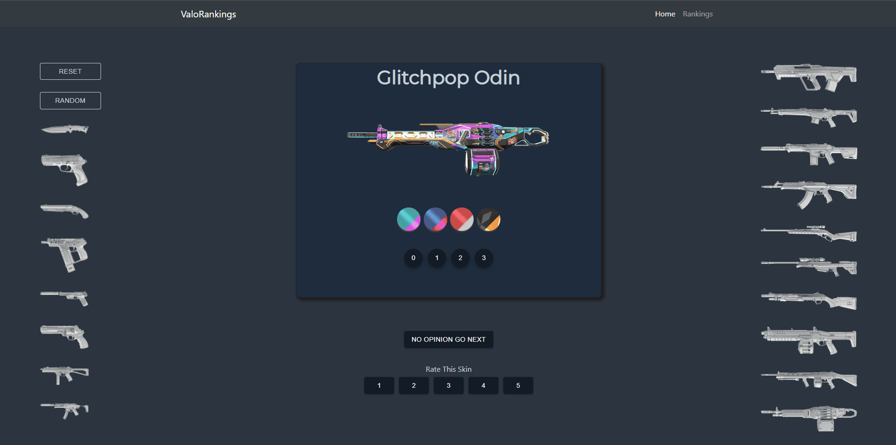

# Valorankings

## Table of Contents
- [Getting Started](#getting-started)
  - [1. Installing Dependencies](#1-how-to-install-dependencies)
  - [2. Running the Project](#2-running-the-project)
- [Project Details](#project-details)
- [Contributers](#contributors)

## Getting Started
Valorankings is a crowdsourcing web app to vote on and show rankings for Valorant cosmetic items.
#### Built With


#### 1. How to Install Dependencies
```bash
npm install
```

#### 2. Running the Project

Run Postgresql server:
```bash
sudo service postgresql start
#create tables
psql -d Valoranking -f schema/schema.sql
#populate tables
psql -d Valoranking -f schema/populateTables.sql
```

Runs development server:
```bash
npm start
npm run server
# or
yarn start
yarn run server
```
The application will be running on [http://localhost:3000](http://localhost:3000).
This script will also run webpack and auto refresh the page whenever you make changes.


## Project Details

<details>
  <summary>
  <h3>Voting</h3>
  </summary>

- #### Vote on cosmetics with a scoring system from 1 to 5

- #### See different chromas and levels of the cosmetic (if it has any)
  

</details>

<details>
  <summary>
  <h3>Filtering</h3>
  </summary>

- #### Filter cosmetic type based on side icons clicked

- #### Reset to default sorting style of jump to a random weapon
  

</details>

<details>
  <summary>
  <h3>Rankings Page</h3>
  </summary>

- #### Shows table of all cosmetic items ranked by total rating

- #### Filter table via side icons to only see rankings for a specific cosmetic type
  

</details>


## Contributors
* [Alex Hu](https://github.com/gunpowder66)

## Learn More
To learn more about React.js, take a look at the following resources:
- [React Documentation](https://reactjs.org/docs/getting-started.html) - learn about React.js features and API.
- [Learn React.js](https://reactjs.org/tutorial/tutorial.html) - an interactive React.js tutorial.
- You can check out [the React.js GitHub repository](https://github.com/facebook/react)


